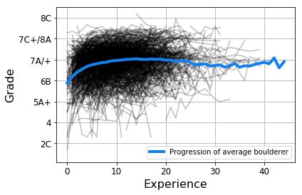
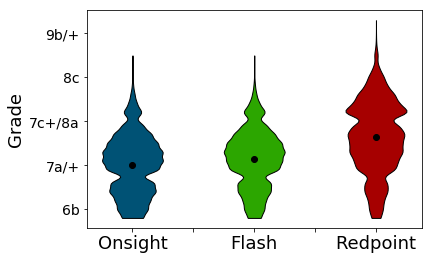
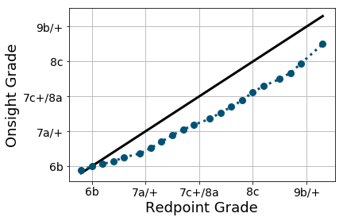

# DataScience-Climbing

The data I used for the analysis is from the 8a.nu dataset that can be downloaded on [Kaggle](https://www.kaggle.com/dcohen21/8anu-climbing-logbook). Analysis was done in Python using ```pandas```. Visualization was done with ```pyplot```.

## Average Progression
Analyse the progression of boulderers based on the average of the three hardest boulders each year. Experience is calculated as the difference between the year a user started climbing and the year of an ascent. The average progression of boulderers is presented in the following figure.



Climbers improve considerably in the first 4-5 years. After that, the progression slowly levels of. For climbers that climb for a long time, the average performance drops only slightly, but remains high.

## Comparison of different ascent methods
How much difference do different ascent methods have on the max grade climbers can climb?
* Onsight = climbed in first try without prior knowledge of the route
* Flash = climbed in first try with prior knowledge of the route
* Redpoint = climbed after x tries



There is not much difference between onsighting and flashing a climb. Both are considerably harder than redpointing. This is also illustrated n the following figure.



The difference in diffulty is especially apparent for higher grades. For lower grades, the average onsight-level of climbers almost matches their redpoint level.
